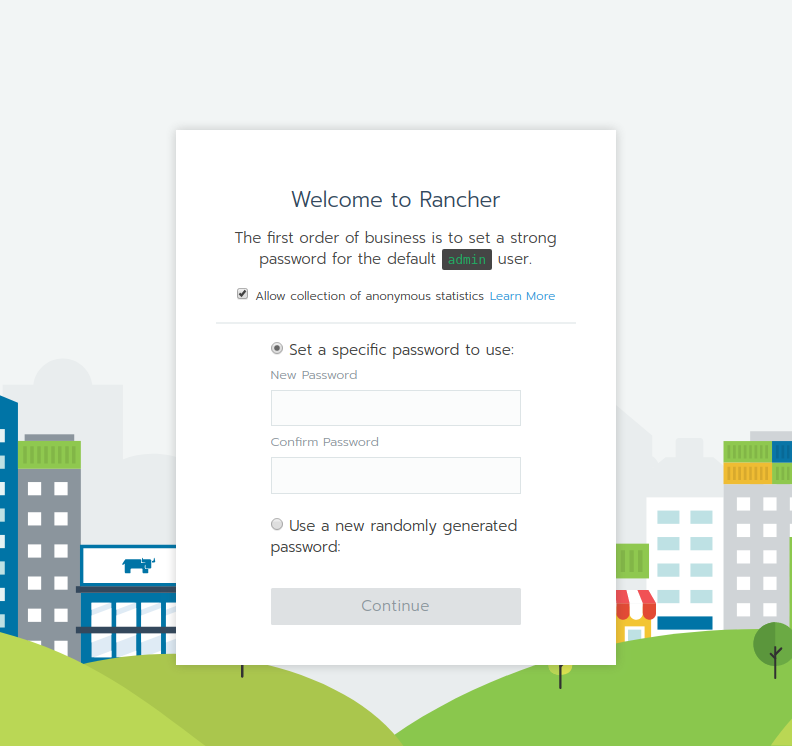
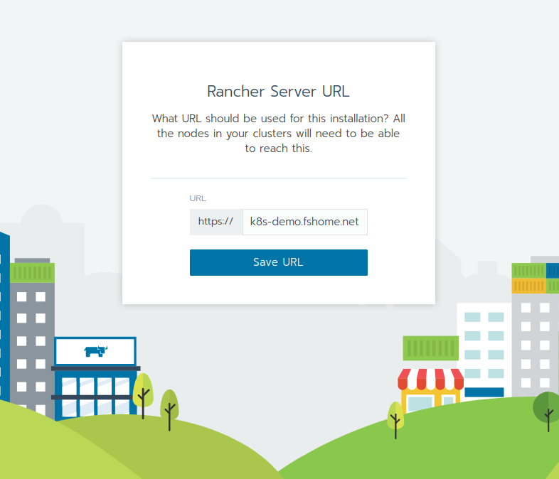
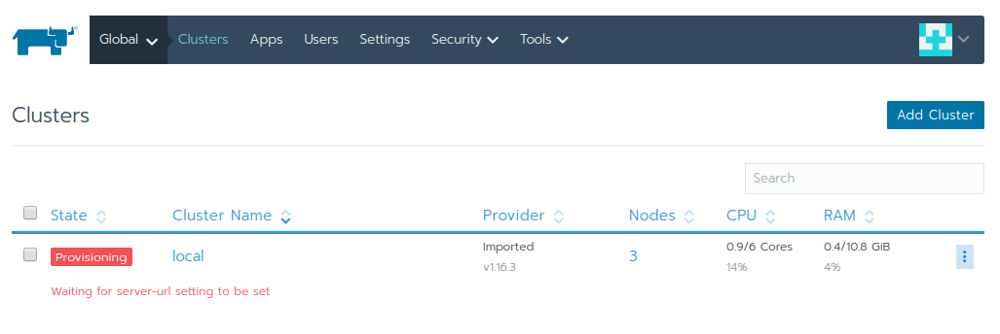
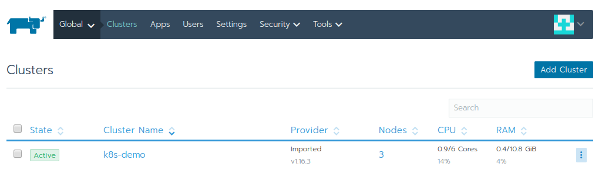
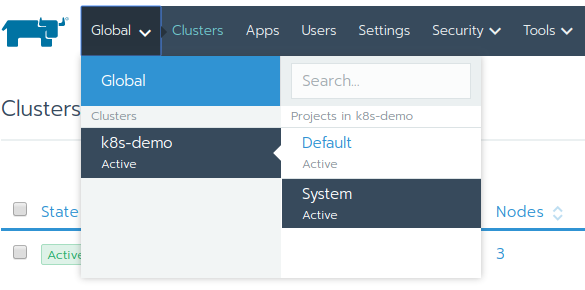
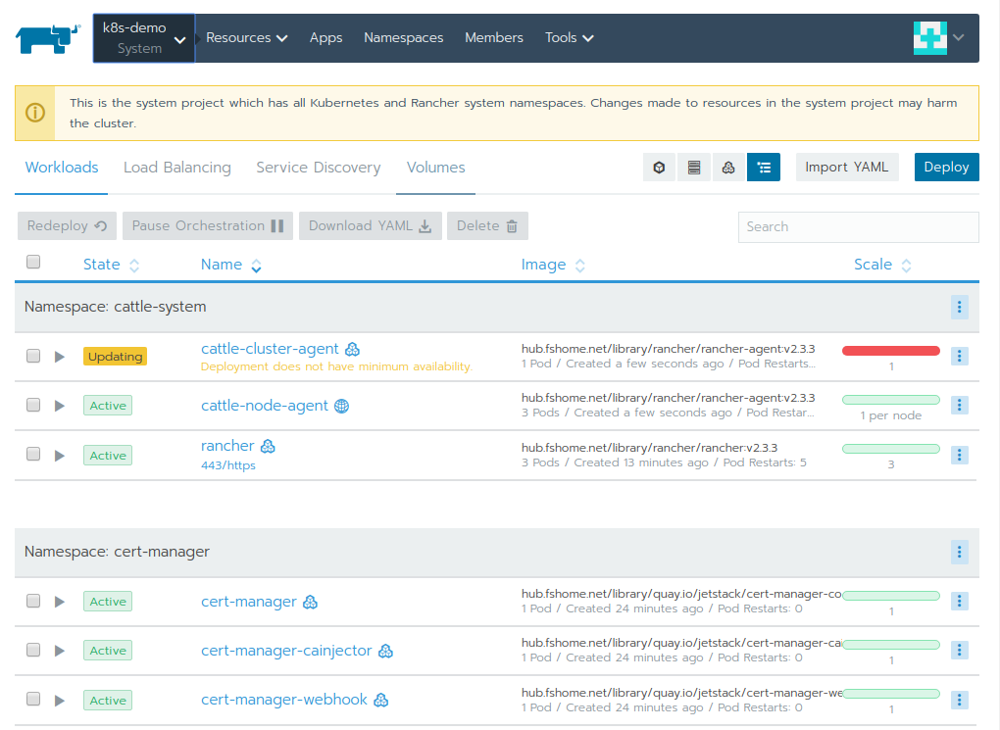
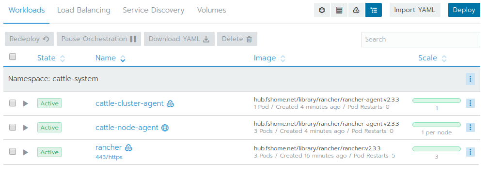

Rancher  HA 安装手册 (v2.3.3)
=

这篇手册详细介绍如何在内网环境(Air gapped / Offline)中安装 HA (高可用) 模式的 Rancher Cluster. 在开始前请确保已经部署了内网镜像仓库 (推荐使用[harbor](https://github.com/goharbor/harbor)).

本手册使用的相关软件包版本如下:

* rke (1.0.0)
* kubernetes (1.16.3)
* kubectl (1.16.3)
* rancher (2.3.3)
* cert-manager (0.9.1)
* helm (3.0.2)
* nginx (1.15.11)

基本步骤包括:

* 准备节点(物理机/虚拟机)
* 准备Load Balancer
* 配置节点, 安装软件
* 准备相关工具
* 准备相关镜像并push到内网镜像仓库中
* 创建 RKE k8s Cluster 配置, 部署 k8s Cluster
* 下载, 配置和部署 cert manager
* 下载, 配置和部署 rancher

# 准备节点(物理机/虚拟机)

本手册使用下面的节点来部署, 请根据实际情况自行调整.

```plaintext
192.168.1.21 k8s-demo-01
192.168.1.22 k8s-demo-02
192.168.1.23 k8s-demo-03
192.168.1.20 k8s-demo-lb-01
192.168.1.20 k8s-demo.fshome.net
```

为确保各节点可以互相访问, 将节点和对应的 IP 添加到 ```/etc/hosts ``` 中

# 准备Load Balancer

这里我们参考 rancher HA 部署的官方最小结构配置一个 nginx 实例来 LB 请求到后端的 k8s 节点.

如下图所示:

```k8s-demo-lb-01``` (192.168.1.20) 是一台部署有 docker 的 VM, 用于运行 nginx 容器. 在 ```k8s-demo-lb-01``` 上创建 nginx 配置文件.

```shell
sudo mkdir -p /data/rke-k8s-ha/
sudo vi /data/rke-k8s-ha/nginx.conf
```

填入下面的内容

```conf
worker_processes 4;
worker_rlimit_nofile 40000;

events {
    worker_connections 8192;
}

stream {
    upstream rancher_servers_http {
        least_conn;
        server k8s-demo-01:80 max_fails=3 fail_timeout=5s;
        server k8s-demo-02:80 max_fails=3 fail_timeout=5s;
        server k8s-demo-03:80 max_fails=3 fail_timeout=5s;
    }
    server {
        listen     80;
        proxy_pass rancher_servers_http;
    }

    upstream rancher_servers_https {
        least_conn;
        server k8s-demo-01:443 max_fails=3 fail_timeout=5s;
        server k8s-demo-02:443 max_fails=3 fail_timeout=5s;
        server k8s-demo-03:443 max_fails=3 fail_timeout=5s;
    }
    server {
        listen     443;
        proxy_pass rancher_servers_https;
    }
}
```

启动 nginx 容器

```shell
docker run -d \
  --restart always \
  --name rke-k8s-nginx \
  -p 80:80 \
  -p 443:443 \
  -v /data/rke-k8s-ha/nginx.conf:/etc/nginx/nginx.conf:ro \
  nginx:1.15.11
```

# 配置节点, 安装软件

请参考 Rancher 官方文档中的最佳实践进行配置

* [基本配置](https://docs.rancher.cn/rancher2x/install-prepare/basic-environment-configuration.html#_4-2-%E9%94%81%E5%AE%9Adocker%E7%89%88%E6%9C%AC)
* [最佳实践](https://docs.rancher.cn/rancher2x/install-prepare/basic-environment-configuration.html#_4-5-%E6%9B%B4%E5%A4%9A%E9%85%8D%E7%BD%AE%E8%AF%B7%E8%AE%BF%E9%97%AE%E6%9C%80%E4%BD%B3%E5%AE%9E%E8%B7%B5)

包括配置 OS (内核, 网络,文件系统等), 以及安装 docker.

准备一个账号 (这里使用 ```user_name``` 作为示例,请根据实际情况创建)

* 确保这个账号有 sudo 权限
* 将这个账号加入 docker 组

然后在执行部署的节点上生成并复制 ssh 公钥到所有节点, 以确保执行部署的节点可以无需密码访问所有节点. 例如这里选则  ```k8s-demo-01``` 作为部署节点.

```shell
# 生成 ssh key
ssh-keygen -t rsa

# 复制到所有节点
ssh-copy-id -i ~/.ssh/id_rsa.pub user_name@k8s-demo-01
ssh-copy-id -i ~/.ssh/id_rsa.pub user_name@k8s-demo-02
ssh-copy-id -i ~/.ssh/id_rsa.pub user_name@k8s-demo-03

# 完成后可以通过ssh命令测试,正常情况下能直接登录不再提示输入密码
ssh user_name@k8s-demo-01
ssh user_name@k8s-demo-02
ssh user_name@k8s-demo-03
```

# 准备相关工具

下载下列工具到执行部署的节点上 (```k8s-demo-01```)

* rke (1.0.0)
* kubectl (1.16.3)
* helm (3.0.2)

```sh
# Download and install RKE tool https://github.com/rancher/rke/releases/tag/v1.0.0
curl -L -o rke_linux-amd64 \
    https://github.com/rancher/rke/releases/download/v1.0.0/rke_linux-amd64
chmod +x rke_linux-amd64
sudo mv rke_linux-amd64 /usr/local/bin/rke

# Download and install kubectl
curl -L -o kubectl-v1.16.3 \
    https://storage.googleapis.com/kubernetes-release/release/v1.16.3/bin/linux/amd64/kubectl
chmod +x kubectl-v1.16.3
sudo mv kubectl-v1.16.3 /usr/local/bin/kubectl

# Download and install helm3
curl -L -o helm-v3.0.2-linux-amd64.tar.gz  https://get.helm.sh/helm-v3.0.2-linux-amd64.tar.gz
tar -zxvf helm-v3.0.2-linux-amd64.tar.gz
sudo mv linux-amd64/helm /usr/local/bin/helm
```

如需使用socks5代理,可以添加参数 ```--socks5 PROXY_IP:PORT``` 如下面的命令所示:

```sh
curl -L -o FILENAME URL --socks5 PROXY_IP:PORT
```

# 准备相关镜像并push到内网镜像仓库中

参考官方文档中关于准备[离线镜像](https://docs.rancher.cn/rancher2x/installation/helm-ha-install/offline/prepare-private-registry.html#_1-%E5%87%86%E5%A4%87%E6%96%87%E4%BB%B6)的部分.

也可使用 ```transfer-images.sh``` 脚本将镜像搬到指定的私有仓库中 ([参考](https://github.com/xiaoyumu/scripting/tree/master/rancher)).

由于我们使用了 harbor 作为私有仓库,它暂时不支持自动创建项目 (镜像目录), 所以这里将镜像导入到 私有仓库的 library 项目 (目录) 中, 后面部分也都使用这一镜像前缀.

后面的私仓均使用 ```$YOUR_IMAGE_REGISTRY``` 代替 ```hub.fshome.net```

```sh
./transfer-images.sh rancher-images.txt $YOUR_IMAGE_REGISTRY/library
```

# 创建 RKE k8s Cluster 配置, 部署 k8s Cluster

RKE 工具使用一个 cluster yaml 文件了来指导部署 k8s cluster, 下面是本例中的 cluster 配置文件, 更多配置可以参考 Rancher [官网示例](https://rancher.com/docs/rke/latest/en/example-yamls/). 

注意将下面的 ```<user_name>``` 替换为提前准备好的用户名.

```shell
tee ./rke-cluster-2.3.3.yml <<-'EOF'
cluster_name: k8s-demo-cluster

private_registries:
  - url: hub.fshome.net/library
    is_default: true

# Use following command to list rke tool supported k8s versions and related docker images 
# rke config --system-images --all
kubernetes_version: v1.16.3-rancher1-1

nodes:
  - address: 192.168.1.21
    hostname_override: k8s-demo-01
    user: <user_name>
    role: [controlplane,etcd,worker]

  - address: 192.168.1.22
    hostname_override: k8s-demo-02
    user: <user_name>
    role: [controlplane,etcd,worker]

  - address: 192.168.1.23
    hostname_override: k8s-demo-03
    user: <user_name>
    role: [controlplane,etcd,worker]

services:
  etcd:
    extra_args:
      auto-compaction-retention: 240
      quota-backend-bytes: '6442450944'
    backup_config:
      enabled: true     # enables recurring etcd snapshots
      interval_hours: 6 # time increment between snapshots
      retention: 60     # time in days before snapshot purge
  kubelet:
    # Fail if swap is on, disable it
    fail_swap_on: false
    # Set max pods to 150 instead of default 110
    extra_args:
      max-pods: 100

# Kubernetes Authorization mode
# Use `mode: rbac` to enable RBAC
# Use `mode: none` to disable authorization
authorization:
  mode: rbac

# There are several network plug-ins that work, but we default to canal
network:
  plugin: flannel
  
# Specify DNS provider (coredns or kube-dns)
dns:
  provider: kube-dns

# Currently only nginx ingress provider is supported.
# # To disable ingress controller, set `provider: none`
ingress:
  provider: nginx

EOF
```

上面的命令将 rke cluster 文件保存到 ```./rke-cluster-2.3.3.yml```, 然后执行下面的命令开始部署 k8s.

```sh
rke up --config ./rke-cluster-2.3.3.yml
```

这时控制台开始输出部署日志.

```log
INFO[0186] [addons] Successfully saved ConfigMap for addon rke-ingress-controller to Kubernetes
INFO[0186] [addons] Executing deploy job rke-ingress-controller
INFO[0191] [ingress] ingress controller nginx deployed successfully
INFO[0191] [addons] Setting up user addons
INFO[0191] [addons] no user addons defined
INFO[0191] Finished building Kubernetes cluster successfully
```

等待数分钟后如果看到下面的内容说明部署成功完成:

```log
Finished building Kubernetes cluster successfully
```

rke 会在执行目录中生成两个文件:

```sh
kube_config_rke-cluster-2.3.3.yml
rke-cluster-2.3.3.rkestate
```

其中 ```rkestate``` 文件用于通过 rke 工具管理 cluster, 在以后升级 cluster时回用到 ([参考](https://rancher.com/docs/rke/latest/en/installation/#save-your-files)).
而 ```ube_config_rke-cluster-2.3.3.yml``` 文件则用于通过 kubectl 操作 cluster.
例如下面的命令可以用于在部署完成后检查 cluster 的运行状况. 另外建议使用命令 ```kubectl get all -A``` 检查  cluster 中所有资源均已部署完毕并运行正常, 没有 pending 或 error 的资源. Pod 数量均达到预期.

```bash
export KUBECONFIG=$(pwd)/kube_config_rke-cluster-2.3.3.yml
kubectl get nodes

NAME            STATUS   ROLES                      AGE   VERSION
k8s-demo-01   Ready    controlplane,etcd,worker   2m21s   v1.16.3
k8s-demo-02   Ready    controlplane,etcd,worker   2m21s   v1.16.3
k8s-demo-03   Ready    controlplane,etcd,worker   2m21s   v1.16.3

kubectl get all -A
# 主要检查 Pod 是否都处于 Running 状态, 有无部署失败的情况.
NAMESPACE       NAME                                          READY   STATUS      RESTARTS   AGE
ingress-nginx   pod/default-http-backend-c8f4dbb5c-v7nn8      1/1     Running     0          2m3s
ingress-nginx   pod/nginx-ingress-controller-427g7            1/1     Running     0          2m3s
ingress-nginx   pod/nginx-ingress-controller-sc58m            1/1     Running     0          2m3s
ingress-nginx   pod/nginx-ingress-controller-xvzbs            1/1     Running     0          2m3s
kube-system     pod/kube-dns-5b5497475f-pdv9j                 3/3     Running     0          2m13s
kube-system     pod/kube-dns-5b5497475f-tlw2t                 3/3     Running     0          99s
kube-system     pod/kube-dns-autoscaler-6b9b6bbcff-4vf2z      1/1     Running     0          2m12s
kube-system     pod/kube-flannel-b6qht                        2/2     Running     0          2m18s
kube-system     pod/kube-flannel-lbg7c                        2/2     Running     0          2m18s
kube-system     pod/kube-flannel-s5ldh                        2/2     Running     0          2m18s
kube-system     pod/metrics-server-6d454d5dd5-pvp7n           1/1     Running     0          2m8s
kube-system     pod/rke-ingress-controller-deploy-job-nlspx   0/1     Completed   0          2m5s
kube-system     pod/rke-kube-dns-addon-deploy-job-bg9xj       0/1     Completed   0          2m15s
kube-system     pod/rke-metrics-addon-deploy-job-5498c        0/1     Completed   0          2m10s
kube-system     pod/rke-network-plugin-deploy-job-drxdr       0/1     Completed   0          2m40s

NAMESPACE       NAME                           TYPE        CLUSTER-IP     EXTERNAL-IP   PORT(S)         AGE
default         service/kubernetes             ClusterIP   10.43.0.1      <none>        443/TCP         3m31s
ingress-nginx   service/default-http-backend   ClusterIP   10.43.230.1    <none>        80/TCP          2m3s
kube-system     service/kube-dns               ClusterIP   10.43.0.10     <none>        53/UDP,53/TCP   2m13s
kube-system     service/metrics-server         ClusterIP   10.43.43.195   <none>        443/TCP         2m8s

NAMESPACE       NAME                                      DESIRED   CURRENT   READY   UP-TO-DATE   AVAILABLE   NODE SELECTOR   AGE
ingress-nginx   daemonset.apps/nginx-ingress-controller   3         3         3       3            3           <none>          2m3s
kube-system     daemonset.apps/kube-flannel               3         3         3       3            3           <none>          2m18s

NAMESPACE       NAME                                   READY   UP-TO-DATE   AVAILABLE   AGE
ingress-nginx   deployment.apps/default-http-backend   1/1     1            1           2m3s
kube-system     deployment.apps/kube-dns               2/2     2            2           2m13s
kube-system     deployment.apps/kube-dns-autoscaler    1/1     1            1           2m13s
kube-system     deployment.apps/metrics-server         1/1     1            1           2m8s

NAMESPACE       NAME                                             DESIRED   CURRENT   READY   AGE
ingress-nginx   replicaset.apps/default-http-backend-c8f4dbb5c   1         1         1       2m3s
kube-system     replicaset.apps/kube-dns-5b5497475f              2         2         2       2m13s
kube-system     replicaset.apps/kube-dns-autoscaler-6b9b6bbcff   1         1         1       2m13s
kube-system     replicaset.apps/metrics-server-6d454d5dd5        1         1         1       2m8s

NAMESPACE     NAME                                          COMPLETIONS   DURATION   AGE
kube-system   job.batch/rke-ingress-controller-deploy-job   1/1           2s         2m5s
kube-system   job.batch/rke-kube-dns-addon-deploy-job       1/1           3s         2m15s
kube-system   job.batch/rke-metrics-addon-deploy-job        1/1           2s         2m10s
kube-system   job.batch/rke-network-plugin-deploy-job       1/1           23s        2m40s

```

确认 cluster 已正常运行后可以继续后面的步骤. 注意上面的 ```export KUBECONFIG=``` 命令只是临时使用，重新打开控制台会话将需要重新设置．

# 下载, 配置和部署 cert manager

通过 helm 可以在线安装 cert-manager, 但如果其镜像由于网络限制无法直接拉取，可以先先下载 chart 包，然后基于 chart 包生成含有私仓镜像路径的 kubectl 部署文件．
执行下面的命令获取 cert manager chart 包，这里我们使用 v0.9.1 版本，经测试与 rancher 2.3.3 工作正常．更低或者更高的版本可能出现部署错误．

下载并部署 cert manager 的 CRD (Customerized Resource Definition) 这一步必须先做.

```shell
curl -L -o cert-manager-crd_0.9.yaml \
    https://raw.githubusercontent.com/jetstack/cert-manager/release-0.9/deploy/manifests/00-crds.yaml

kubectl apply -f cert-manager-crd_0.9.yaml

# 输出下面内容说明创建成功.
customresourcedefinition.apiextensions.k8s.io/certificates.certmanager.k8s.io created
customresourcedefinition.apiextensions.k8s.io/certificaterequests.certmanager.k8s.io created
customresourcedefinition.apiextensions.k8s.io/challenges.certmanager.k8s.io created
customresourcedefinition.apiextensions.k8s.io/clusterissuers.certmanager.k8s.io created
customresourcedefinition.apiextensions.k8s.io/issuers.certmanager.k8s.io created
customresourcedefinition.apiextensions.k8s.io/orders.certmanager.k8s.io created

```

在 k8s 中创建 cert-manager namespace 并标记禁用验证

```shell
kubectl create namespace cert-manager
kubectl label namespace cert-manager certmanager.k8s.io/disable-validation=true
```

获取 cert-manager chart 包,  也可以从其他可以联网的机器上下载后复制到部署节点上.

```shell
# 添加 jetstack charts repo 
helm repo add jetstack https://charts.jetstack.io

# 更新 helm repo
helm repo update

# 获取 v0.9.1版本的 cert-manager chart 包到本地
helm fetch --version v0.9.1 jetstack/cert-manager
```

解包 cert-manager-v0.9.1.tgz 可以看到其中 deployment.yaml文件中包含的 image. 事先通过可以联网的机器将其拉到私仓中.

```shell
quay.io/jetstack/cert-manager-controller:v0.9.1
quay.io/jetstack/cert-manager-cainjector:v0.9.1
quay.io/jetstack/cert-manager-webhook:v0.9.1
# Pull, Tag and Push ==>
$YOUR_IMAGE_REGISTRY/library/quay.io/jetstack/cert-manager-controller:v0.9.1
$YOUR_IMAGE_REGISTRY/library/quay.io/jetstack/cert-manager-cainjector:v0.9.1
$YOUR_IMAGE_REGISTRY/library/quay.io/jetstack/cert-manager-webhook:v0.9.1
```

执行下面的命令将 chart 解包并将镜像替换为本地私仓的路径, 注意镜像名称后面不要带版本 tag, helm 命令在解包时会自动通过 chart 中包含的版本信息补全镜像 tag.

```shell
helm template cert-manager \
  ./cert-manager-v0.9.1.tgz \
  --output-dir . \
  --namespace cert-manager \
  --set image.repository=$YOUR_IMAGE_REGISTRY/library/quay.io/jetstack/cert-manager-controller \
  --set cainjector.image.repository=$YOUR_IMAGE_REGISTRY/library/quay.io/jetstack/cert-manager-cainjector \
  --set webhook.image.repository=$YOUR_IMAGE_REGISTRY/library/quay.io/jetstack/cert-manager-webhook  
```

如果命令正确执行, 会输出类似下面的文本内容.

```text
wrote ./cert-manager/charts/cainjector/templates/serviceaccount.yaml
wrote ./cert-manager/charts/webhook/templates/serviceaccount.yaml
wrote ./cert-manager/templates/serviceaccount.yaml
wrote ./cert-manager/charts/cainjector/templates/rbac.yaml
wrote ./cert-manager/charts/webhook/templates/rbac.yaml
wrote ./cert-manager/templates/rbac.yaml
...
wrote ./cert-manager/charts/cainjector/templates/deployment.yaml
wrote ./cert-manager/charts/webhook/templates/deployment.yaml
wrote ./cert-manager/templates/deployment.yaml
wrote ./cert-manager/charts/webhook/templates/apiservice.yaml
wrote ./cert-manager/charts/webhook/templates/rbac.yaml
wrote ./cert-manager/charts/webhook/templates/pki.yaml
...
wrote ./cert-manager/charts/webhook/templates/validating-webhook.yaml
```

注意检查三个名为 ```deployment.yaml``` 的文件,确保其中的镜像替换正确.

```shell
grep "image: " ./cert-manager/charts/cainjector/templates/deployment.yaml
grep "image: " ./cert-manager/charts/webhook/templates/deployment.yaml
grep "image: " ./cert-manager/templates/deployment.yaml
```

如以上步骤正常完成, 接下来可以执行命令部署 cert-manager.

```shell
kubectl apply -R -f ./cert-manager

# 输出如下内容说明部署完成
deployment.apps/cert-manager-cainjector created
clusterrole.rbac.authorization.k8s.io/cert-manager-cainjector created
clusterrolebinding.rbac.authorization.k8s.io/cert-manager-cainjector created
serviceaccount/cert-manager-cainjector created
apiservice.apiregistration.k8s.io/v1beta1.admission.certmanager.k8s.io created
deployment.apps/cert-manager-webhook created
certificate.certmanager.k8s.io/cert-manager-webhook-webhook-tls created
certificate.certmanager.k8s.io/cert-manager-webhook-ca created
issuer.certmanager.k8s.io/cert-manager-webhook-ca created
issuer.certmanager.k8s.io/cert-manager-webhook-selfsign created
clusterrole.rbac.authorization.k8s.io/cert-manager-webhook:webhook-requester created
clusterrolebinding.rbac.authorization.k8s.io/cert-manager-webhook:auth-delegator created
rolebinding.rbac.authorization.k8s.io/cert-manager-webhook:webhook-authentication-reader created
service/cert-manager-webhook created
serviceaccount/cert-manager-webhook created
validatingwebhookconfiguration.admissionregistration.k8s.io/cert-manager-webhook created
deployment.apps/cert-manager created
clusterrole.rbac.authorization.k8s.io/cert-manager-controller-ingress-shim created
clusterrole.rbac.authorization.k8s.io/cert-manager-controller-orders created
clusterrole.rbac.authorization.k8s.io/cert-manager-controller-clusterissuers created
clusterrole.rbac.authorization.k8s.io/cert-manager-view created
clusterrole.rbac.authorization.k8s.io/cert-manager-leaderelection created
clusterrole.rbac.authorization.k8s.io/cert-manager-controller-certificates created
clusterrole.rbac.authorization.k8s.io/cert-manager-edit created
clusterrole.rbac.authorization.k8s.io/cert-manager-controller-challenges created
clusterrole.rbac.authorization.k8s.io/cert-manager-controller-issuers created
clusterrolebinding.rbac.authorization.k8s.io/cert-manager-controller-issuers created
clusterrolebinding.rbac.authorization.k8s.io/cert-manager-controller-clusterissuers created
clusterrolebinding.rbac.authorization.k8s.io/cert-manager-controller-ingress-shim created
clusterrolebinding.rbac.authorization.k8s.io/cert-manager-controller-orders created
clusterrolebinding.rbac.authorization.k8s.io/cert-manager-controller-challenges created
clusterrolebinding.rbac.authorization.k8s.io/cert-manager-controller-certificates created
clusterrolebinding.rbac.authorization.k8s.io/cert-manager-leaderelection created
serviceaccount/cert-manager created

```

可能需要数分钟 cert manager的组件才会完全启动. 可以通过 ```kubectl get all -n cert-manager``` 命令查看各资源的部署情况.

确保 cert manager的相关资源处于运行状态

```shell
kubectl get all -n cert-manager

NAME                                           READY   STATUS    RESTARTS   AGE
pod/cert-manager-6b6c7665b7-xd5qx              1/1     Running   0          7m43s
pod/cert-manager-cainjector-6cd5b7dfc8-8bnq4   1/1     Running   0          7m44s
pod/cert-manager-webhook-6c799c657f-545mb      1/1     Running   0          7m44s

NAME                           TYPE        CLUSTER-IP     EXTERNAL-IP   PORT(S)   AGE
service/cert-manager-webhook   ClusterIP   10.43.34.223   <none>        443/TCP   7m44s

NAME                                      READY   UP-TO-DATE   AVAILABLE   AGE
deployment.apps/cert-manager              1/1     1            1           7m44s
deployment.apps/cert-manager-cainjector   1/1     1            1           7m45s
deployment.apps/cert-manager-webhook      1/1     1            1           7m45s

NAME                                                 DESIRED   CURRENT   READY   AGE
replicaset.apps/cert-manager-6b6c7665b7              1         1         1       7m44s
replicaset.apps/cert-manager-cainjector-6cd5b7dfc8   1         1         1       7m45s
replicaset.apps/cert-manager-webhook-6c799c657f      1         1         1       7m45s


```

# 下载, 配置和部署 rancher

接下来我们可以开始在这个通过 RKE 安装的 K8S cluster 中部署 Rancher 2.3.3.

首先通过 helm 获取 rancher 2.3.3 版本的 chart 包.

```shell
helm repo add rancher-stable https://releases.rancher.com/server-charts/stable
helm repo update
helm fetch --version 2.3.3 rancher-stable/rancher
```

执行下面的命令解包  chart , 指定 rancher namespace 并替换镜像．

```shell
helm template rancher \
  ./rancher-2.3.3.tgz \
  --output-dir . \
  --namespace cattle-system \
  --set hostname=k8s-demo.fshome.net \
  --set rancherImage=$YOUR_IMAGE_REGISTRY/library/rancher/rancher
```

注意这里的hostname 我们指定了 LB 的域名, 并且不能在这里用 LB 的 IP地址,否则在部署时会提示下面的错误.

```shell
The Ingress "rancher" is invalid: spec.rules[0].host: Invalid value: "xxx.xxx.xxx.xxx": must be a DNS name, not an IP address
```

创建 K8S namespace, 部署 rancher

```shell
kubectl create namespace cattle-system
kubectl --namespace=cattle-system apply -R -f ./rancher
```

通过命令 ```kubectl get all -n cattle-system``` 检查部署情况.

```shell
kubectl get all -n cattle-system

# 输出如下内容说明部署成功完成
NAME                           READY   STATUS    RESTARTS   AGE
pod/rancher-75846dbdd6-9gsht   1/1     Running   0          5m39s
pod/rancher-75846dbdd6-bxrp9   1/1     Running   0          5m39s
pod/rancher-75846dbdd6-pzcrp   1/1     Running   0          5m39s

NAME              TYPE        CLUSTER-IP    EXTERNAL-IP   PORT(S)   AGE
service/rancher   ClusterIP   10.43.23.48   <none>        80/TCP    5m39s

NAME                      READY   UP-TO-DATE   AVAILABLE   AGE
deployment.apps/rancher   3/3     3            3           5m39s

NAME                                 DESIRED   CURRENT   READY   AGE
replicaset.apps/rancher-75846dbdd6   3         3         3       5m39s

```

数分钟后, 可以通过浏览器访问 https://k8s-demo.fshome.net 首次登录 rancher.
由于我们使用了 cert-manager自动生成的SSL证书,浏览器会提示站点不安全, 忽略并继续前往即可.

首次登录可以看到提示修改 admin 密码的提示:



输入初始密码后, 提示确认 server url, 如下图所示, 这里不用修改,保存即可.



完成后就进入 Rancher 的主页面了, 可以看到这里有一个警告提示等待设置 server url. 我们上一步就是设置这个 url, 进入 Global Settings 里面也可以看到 server url  已经设置. 



这时我们只需修改一下 cluster 的名字, 比如从 local 改为 k8s-demo, 这个错误提示就消失了.



接下来打开 Global 菜单下的 Cluster 名字对应的 System Project



可以看到 cattle-cluster-agent Work loads 没有部署成功.



这是由于 cattle-cluster-agent POD 无法解析 server url 对应的域名, 所以需要手动为这个 POD 添加一个 host alias. 可以通过 kubectl 命令,也可以在 Rancher UI 上 Update 这个 POD.

下面这个命令执行后, 可以看到 POD 稍等片刻就部署正常了.

```shell
kubectl -n cattle-system \
  patch deployments cattle-cluster-agent \
  --patch '{"spec": {"template": {"spec": {"hostAliases": [{"hostnames":["k8s-demo.fshome.net"],"ip": "192.168.1.20"}]}}}}'
```



至此, Rancher K8S Cluster 的 HA 部署就完成了. 赶快去体验 Rancher 的世界吧.

谢谢观赏!
:)